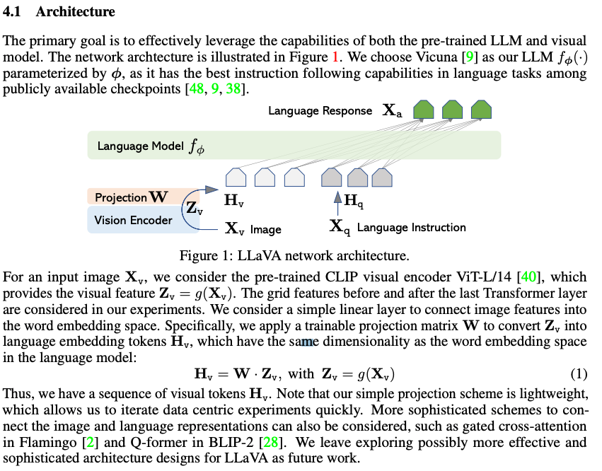
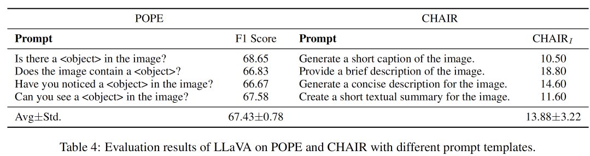
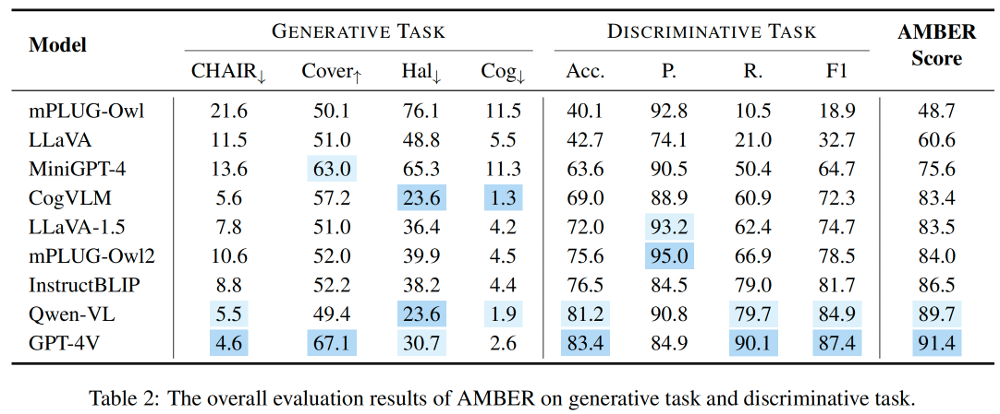
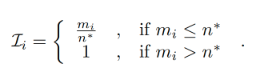
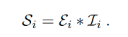
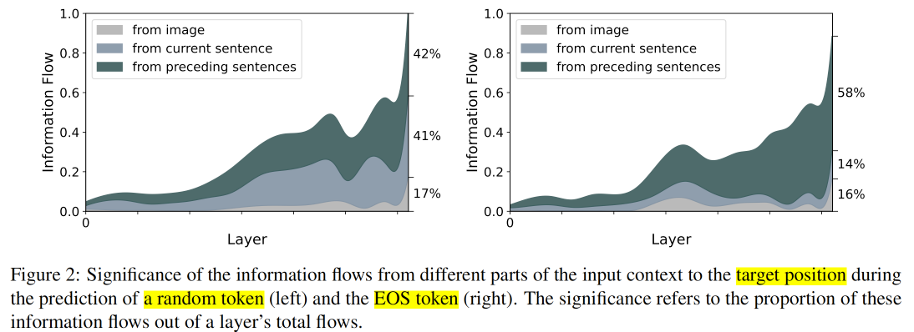
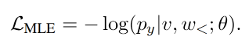
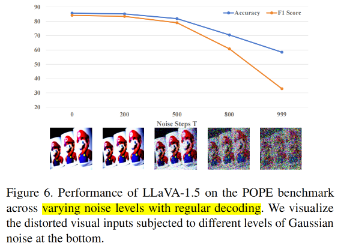
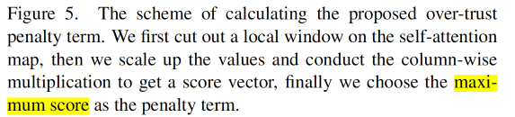

**llava**

 LLaVA-OneVision: Easy Visual Task Transfer

llava模型系列文章[https://llava-vl.github.io/blog/](https://llava-vl.github.io/blog/)

LLM使用的是Qwen-2, 视觉编码选择SigLIP


```markdown
token策略
- 单张图片
- 多张图片
- 视频
```
```
vision和language是如何融合的
- learnable query-based
- Projection layer

- end-to-end training
```


# 幻觉

 Hallucination of Multimodal Large Language Models: A Survey


# survey

[Awesome-Multimodal-Large-Language-Models](https://github.com/BradyFU/Awesome-Multimodal-Large-Language-Models)

**幻觉是什么？**

- Factuality hallucination
  模型生成内容与真实世界的信息不符

- Faithfulness hallucination
  模型生成的内容偏离用户指令和上下文信息

在MLLMs中，幻觉主要指模型回答和视觉输入信息的不一致，多模态模型的非一致性。


-----

**MLLMs幻觉主要是“对象幻觉”（object hallucination）**

- **category**类别幻觉：模型识别出图像中不存在的对象类别，或者将对象识别为错误的类别。例如，在图像中没有“云”的情况下，模型却描述有云☁️的存在。

- **attribute**属性幻觉：模型识别的对象类别是正确的，但描述其属性（如颜色、形状、材质等）时出错。例如，将“绿色的树”描述为“红色的树”。

- **Relation**关系幻觉：模型正确识别了图像中的对象及其属性，但错误地描述了对象之间的关系，例如描述人物位置、交互等错误。


-----

**幻觉来源**

- data
- model
- training
- Inference


-----

**LLMs&MLLMs**

| LLMs         | MLLMs              |
| ------------ | ------------------ |
| Pre-training | Pre-training       |
| SFT          | Instruction-tuning |
| RLHF         |                    |

**如何训练MLLMs**

- 使用预训练好的模型 vision+LLM
  使用可学习的部分将vison 和LLM 链接起来
  - Learnable query tokens 交叉注意力机制获取vision信息。
    [Q-Former](#BLIP-2: Bootstrapping Language-Image Pre-training with Frozen Image Encoders and Large Language Models) 
  - projection layer
    [llava](#Visual Instruction Tuning)
- 端到端学习
  不使用预训练好的视觉编码器，将图片打成patch通过线性层变成mbedding向量和text-emebedding拼接输入transformer。

- 损失
  - Pre-training
    - ITC(Image-Text Contrastive Learning), 对齐图像特征和文本特征eg:[CLIP](#Learning Transferable Visual Models From Natural Language Supervision)
    - ITM(Image-Text Matching), 二分类任务，图像-文本对是正匹配还是负匹配
    - ITG(Image-grounded Text Generation), 生成式任务的交叉熵损失
  - Instruction-tuning
    使用合成数据&标注数据， 格式(visual content - instruction - response)

## Hallucination Causes

### Hallucination from Data

#### Data Quantity

文本对数据和VQA数据， 数据量不足会影响多模态模型的对齐，进而引起幻觉。

#### Data Quality

##### Noisy data

[LLaVA](#Visual Instruction Tuning)使用GPT-4生成数据作为训练数据，数据合成的时候还没有使用照片本身，会出现噪声数据， LLaVA-1.5添加人类标注数据，实验说明了noisy data会导致幻觉。

#####  Lack of diversity

微调数据中缺乏负例 

<details>
  <summary>Positive instruction</summary>
  这类指令是关于图像内容的准确描述或问题，直接反映了图像中的实际信息。例如，描述一张图片中的物体、场景或动作。这类数据**有助于模型学习准确地理解和描述图像内容**。通常的多模态训练数据以这种类型为主，模型因此倾向于认为输入中的内容总是准确的
</details>

<details>
  <summary>negative instruction</summary>
  这类指令涉及图像中不存在的对象、属性或关系，要求模型正确地识别并回应“图像中没有这个内容”。例如，图像中并没有狗，但指令却问“这张图片中是否有狗？”。这类指令**对模型识别“不存在”场景的能力有帮助**。当前的大部分数据集中缺乏这样的反向样本，因此模型往往会倾向于给出肯定的回答，即使输入的内容是不存在的
</details>
由于缺乏反向指令训练数据，模型的判断往往会偏向“存在”或“肯定”的回答，而非准确地识别并否定输入中的错误信息，这也会导致幻觉现象的发生

含有正负例数据集[Large-scale Robust Visual (LRV)-Instruction](# Mitigating Hallucination in Large Multi-Modal Models via Robust Instruction Tuning)

##### Detailed descriptions

<details>
<summary>描述细节缺失</summary>
训练数据通常缺乏对对象位置、属性和关系的详细描述，这导致模型在跨模态对齐时出现不足，削弱了模型的视觉内容理解和定位能力
</details>

<details>
<summary>过度详细的描述</summary>
过于详细的文本描述会超过模型的极限，尤其是当训练数据包含了过多的细节而模型无法从图像中提取这些细节时。导致模型会尝试生成符合“详细描述”的内容， 进而引起“幻觉”
</details>

过少的文字描述细节会限制模型能力， 过多的文字描述细节可能会引发幻觉。

#### Statistic Bias

<details>
	<summary>高频对象偏差</summary>
  某些对象在训练数据中出现频率过高，例如“人”可能在大量图片中反复出现。这种偏差导致模型在生成描述时倾向于假设这些常见对象的存在，即使实际图像中并不包含这些对象。例如，在不包含人的图片中，模型仍可能错误地描述为“有人”。
</details>  

<details>
<summary> 对象共现（co-occurrence）偏差</summary>
模型会倾向于记住某些对象经常共同出现的情况。例如，冰箱和微波炉通常会出现在厨房的图像中。因此，当模型看到冰箱时，可能会推断出微波炉的存在，即使实际图片中并没有微波炉。
</details> 

这些偏差的存在使得模型在生成描述时容易受到训练数据分布的影响，进而产生不准确的输出，导致“幻觉”现象的发生。**增加数据多样性或扩大数据规模**可以在一定程度上减轻这些偏差，但无法完全消除，因为现实世界中的数据分布本身具有长尾特性

### Hallucination from Model

<details>
<summary>视觉模型的局限性</summary>
视觉模型如果较弱，可能会导致对视觉信息的误解或信息丢失。即使是最先进的视觉模型在编码视觉内容时也会有信息丢失，这会直接影响模型对多模态信息的理解，从而导致错误描述或“幻觉”。
</details>

<details>
<summary>语言模型的先验知识</summary>
在大多数多模态模型架构中，语言模型通常比视觉模型更大更强，这导致模型在生成内容时倾向于依赖语言中的先验知识。这种偏向会使模型忽视视觉输入中的实际信息。例如，当图像中出现一个红色的香蕉时，模型可能仍然会根据语言知识生成“黄色香蕉”，因为它预设“香蕉是黄色的”。
</details>

<details>
<summary>对齐接口的局限性</summary>
视觉模型和语言模型之间的接口是多模态模型的关键环节，弱对齐接口会导致跨模态信息传递不充分或错误。当前接口架构（如线性投影层和Q-former查询机制）存在局限性，在视觉和语言嵌入的对齐上存在差距，可能会导致细节信息丢失或不准确的跨模态映射，从而导致“幻觉”现象。
</details>
### Hallucination from Training

<details>
  <summary>训练目标的局限性</summary>
  MLLMs的训练通常使用自回归的下一个词预测损失（token-level的Cross-Entropy Loss），这种损失在语言建模中表现优异，但在处理视觉内容的复杂空间结构时可能不足。由于缺乏对视觉内容的全局监督，模型可能会倾向于生成语言知识，而忽视视觉内容，导致幻觉现象。
</details>

<details>
  <summary>序列级别的监督缺失</summary>
  当前的训练损失主要基于词或token级别，缺乏在序列级别上的监督，导致模型可能未能充分理解视觉输入的整体信息。这种局限性可能导致生成文本内容偏离视觉输入的实际内容
</details>

<details>
  <summary>缺乏人类反馈的强化学习</summary>
  在训练LLMs时，强化学习（RLHF）已被证明可以帮助模型更好地对齐人类偏好，但该阶段在MLLMs的训练中通常缺失。缺乏这种反馈机制可能使得模型在视觉与文本的对齐上不够精确，增加了幻觉的风险。
</details>

### Hallucination from Inference

在生成过程中，随着生成的序列长度增加，模型的自注意力机制逐渐更多地集中在先前生成的文本token上，而对视觉内容的关注则逐步减弱。

"Losing attention"

## Hullucination Metrics and Benchmarks


### CHAIR


CHAIR通过计算生成的文本中提到的对象与实际图像内容的一致性，来衡量模型是否出现幻觉现象。CHAIR有两种变体：

1. **CHAIRi**：基于实例的评估，计算生成文本中出现的幻觉对象占所有提到对象的比例。
2. **CHAIRs**：基于句子的评估，计算包含幻觉对象的句子占所有句子的比例。


### [POPE](# Evaluating Object Hallucination in Large Vision-Language Models)

CHAIR评估结果**不稳定**：依赖文本描述长度和指令设计。

提出POPE，将幻觉检测转换为一个二分类"yes-or-no"的问题， 指标选择accuracy, precision, recall, F1.

数据来源：MSCOCO数据集中抽取500张图片


### [MME](# MME: A Comprehensive Evaluation Benchmark for Multimodal Large Language Models)

和POPE类似， 是一个yes-or-no的判别式任务。

POPE粗粒度（coarse-grained), 只设计到object hallucination， POPE的测评更加全面，细粒度（fine-grained)， 包括attribute hallucination的测试等

测试任务范围更广：14个子任务


### [CIEM](#CIEM: Contrastive Instruction Evaluation Method for Better Instruction Tuning)

前面提到的测评指标需要人工标注数据， 没有给出减少幻觉的方法。

POPE/MME的判断类型的测评指标只让模型输出yes/no,缺乏详细的判断原因。

提出的CIEM benchmark利用GPT实现automatic pipeline.

提出CIT构建数据集（包括正例和负例）微调模型减少因为数据集缺乏多样性导致的幻觉。


### [GAVIE](#Mitigating Hallucination in Large Multi-Modal Models via Robust Instruction Tuning)

开放式问题。

使用GPT4对结果进行打分（1-10）


### [NOPE](# Negative Object Presence Evaluation (NOPE) to Measure Object Hallucination in Vision-Language Models)

明确区分了VQA问题中的的object halucination 和 incorrectness的区别

- 对象幻觉：当正确回答是'no'的时候， 模型给出了图片中不存在物品的回答
- 回答错误：模型回答错误， 回答中没有包含不存在的对象

弥补负面数据的缺失：设计包含否定回答的QA对。 

提出了一个构造包含负例的数据集构造流程


### HaELM

数据集收集：收集涵盖多个MLLM生成的幻觉数据集， 来源：

- LLaVA, MiniGPT-4的生成内容
- 通过GPT模拟生成的数据， 进一步丰富样本

模型训练：选择LLaVA作为基础模型

评估指标： acc, pecision, recall等

优点：成本低， 针对专门的幻觉类型进行了训练。


### FaithScore

FaithScore设计用于评估MLLMs在开放式问题中的自由回答是否存在幻觉现象。与依赖高级LLM整体评估的传统方法不同，FaithScore通过自动化流水线细化评估过程，包括以下步骤：

- 描述性子句识别：
  将生成的自由回答分解为多个描述性子句（描述性子句是指具体描述对象的短语或句子）。

- 生成原子事实：
  基于识别出的描述性子句，进一步分解为更小的原子事实（如对象、颜色、关系等）。

- 事实验证：
  对每个原子事实进行验证，判断其是否与视觉内容一致。

**细粒度幻觉分类**：

FaithScore能够针对不同类型的幻觉现象进行细粒度评估，包括：实体幻觉（Entity Hallucination），计数幻觉（Count Hallucination）等

计算方法：
$$\text{FaithScore} = 1 - \frac{\text{幻觉内容的数量}}{\text{生成内容的总数量}}$$

相比测评指标CHAIR， CHAIR只分析了对象幻觉， FaithScore分析更加详细（细粒度）


### [AMBER](#AMBER: An LLM-free Multi-dimensional Benchmark for MLLMs Hallucination Evaluation)

可以同时评估MLLMs的生成式任务和判断式任务
测评不需要额外的LLM


### [FGHE](#FGHE:Fine-Grained Object Hallucination Evaluation)


<details>
  <summary>评估指标</summary>
  - 判别式任务/生成式任务， 开放式问题还是选择性问题
  - 检测幻觉的范围
  幻觉检测：
	1. 人工或者GPT-4， 耗时耗力
	2. 训练一个幻觉检测模型
	3. yes-or-no判断型任务，一般只适用对象检测，
</details>


## Hallucination Mitigation

### Data

#### LRV-Instruction

<details>
  <summary>引入负向指令样本，平衡数据中正负向数据的比例。显著减少模型在指令回答的时候的幻觉</summary>
  现有问题：
当前的多模态模型在指令调优（Instruction Tuning）过程中，训练数据通常偏向于 正向指令样本（positive instruction samples），即大部分训练数据描述的是图像内容的真实情况。
这种数据分布导致模型倾向于对任何指令回答 "Yes"，即使正确答案应为 "No"。这种现象会导致幻觉问题，即模型在生成文本时描述了图像中不存在的对象或属性。
	解决方案：
为了解决这一问题，LRV-Instruction 提出了通过引入 负向指令样本（negative instruction samples） 来提高模型对指令的鲁棒性，平衡训练数据。
</details>
#### [**HalluciDoctor**](#HalluciDoctor: Mitigating Hallucinatory Toxicity in Visual Instruction Data)

检查并减少现有数据集（eg：LLaVA）中的幻觉。 改进数据的分布， 减少对象共现频率高产生的幻觉， 在原有的数据集上生成一些反事实的视觉指令数据。

#### [ReCaption](#Mitigating Fine-Grained Hallucination by Fine-Tuning Large Vision-Language Models with Caption Rewrites)

作者

#### [EOS Decision](#Less is More: Mitigating Multimodal Hallucination from an EOS Decision Perspective)

作者发现使用过于详细的训练数据训练得到的模型在输出的时候会倾向于输出超过其感知能力的细节内容，进而导致幻觉。

作者通过训练目标优化或者训练数据过滤策略来提高模型输出EOS token的能力， 让模型不输出超过其感知能力外的内容， 来减少幻觉， 同时输出内容的语义丰富度没有很大的降低。


### Model

#### Scale-up Resolution

- LLaVa系列模型: 将视觉编码器从CLIP-ViT-L-224扩展到CLIP-ViT-L-336。提高视觉编码器的分辨率等于是提高了模型感知能力。
- Owen-VL系列： 逐步增加图像分辨率（从224 × 224到448 × 448）。

#### Versatile Vision Encoders

通过更灵活和多样化的视觉编码器来缓解多模态大语言模型（MLLMs）中的幻觉现象。

- 传统视觉编码器的局限性
  大多数MLLMs使用CLIP ViT图像编码器作为视觉编码器，因为它能够提取语义丰富的特征。有研究发现CLIP编码器相比于专注于视觉任务的模型（如DINO ViT）在捕获视觉细节方面存在不足，可能导致信息丢失。
  有些研究将CLIP ViT和DINO ViT的特征混合使用，但是怎么融合和权衡需要进一步研究对应的机制。
- 使用OCR等工具来提取视觉中的先验知识.....


### Training

#### Auxiliary supervision

<details>
  <summary>训练目标可能无法完全利用视觉信息</summary>
  MLLMs的训练目标通常是通过语言模型损失（CrossEntropyLoss）进行自回归的下一个词预测。这种方法在处理语言任务时效果显著，但在多模态任务中可能不够充分。视觉内容包含丰富的空间结构和细节信息，单纯依赖语言建模损失可能无法完全利用这些信息，导致幻觉现象的产生。
</details>

对比学习增强对齐：

- 现有的MLLMs通常通过将视觉特征投影到语言模型的输入空间实现跨模态对齐。然而，这种对齐可能存在显著的模态间分布差异，导致跨模态交互效果不佳，进而引发幻觉。比如：[HACL  Hard Alignment Contrastive Loss](https://arxiv.org/abs/2312.06968)
  - 将具有幻觉的文本作为“强负样本”（hard negative examples）。
  - 对比学习目标是将正确的视觉-文本样本特征拉近，同时将幻觉样本特征拉远。
  - 这种方法增强了视觉和文本表示的对齐效果，减少了由模态间分布差异引发的幻觉。

#### Reinforcement Learning

引入**RLHF**阶段，调整模型行为，使其更符合人类偏好， 减少幻觉， 比如LLaVA-RLHF。


### Inference

#### [VCD](#Mitigating Object Hallucinations in Large Vision-Language Models through Visual Contrastive Decoding)

- 动机：VLM 存在物体幻觉的问题，即生成图像中不存在的物体。之前的研究确定了幻觉主要是因为训练数据中的偏差以及语言模型固有的语言先验知识。如何针对这一幻觉现象提出解决办法？

- 做法：作者首先逐步给输入加入更强的[高斯噪声](https://zhida.zhihu.com/search?content_id=243383809&content_type=Article&match_order=1&q=高斯噪声&zhida_source=entity)，发现随着图像失真的越来越严重，模型的输出越来越依赖于语言先验知识。提出 Visual Contrastive Decoding(VCD) 的方法，做法是对于一个文本查询和视觉输入，模型会分别产生原始输出，以及将视觉加入高斯噪声后的输出，然后将两者输出的概率分布做差作为新的概率分布进行解码。


#### [OPERA](#OPERA: Alleviating Hallucination in Multi-Modal Large Language Models via Over-Trust Penalty and Retrospection-Allocation)

作者观察到，幻觉的出现与自注意力矩阵中的知识聚合模式密切相关，这些模式倾向于依赖少数总结性token生成新token，而忽视了其他token，尤其是视觉token，进而导致内容幻觉。基于这一观察，OPERA方法在beam-search解码过程中引入了一个惩罚项来缓解过度信任问题，并通过回溯策略重新分配token的选择。


#### [PAI](#Paying More Attention to Image: A Training-Free Method for Alleviating Hallucination in LVLMs)


# 论文

## BLIP-2: Bootstrapping Language-Image Pre-training with Frozen Image Encoders and Large Language Models

https://arxiv.org/pdf/2301.12597

训练Q-former实现跨模态语义融合


----

训练FC参数实现视觉到语言


> [1](https://zhuanlan.zhihu.com/p/681268266) [2](https://zhuanlan.zhihu.com/p/606364639) 


##  [Visual Instruction Tuning](https://papers.cool/arxiv/2304.08485)

通过全连接得到image-embedding


> [1](https://zhuanlan.zhihu.com/p/653902791) [如何训练MLLMs?](# 如何训练MLLMs?)

## [Learning Transferable Visual Models From Natural Language Supervision](https://papers.cool/arxiv/2103.00020)


> [1](https://zhuanlan.zhihu.com/p/653902791)

## [Visual Instruction Tuning](https://papers.cool/arxiv/2304.08485)

显示用GPT-4生成数据， 输入给GPT-4的是‘Captions'和'坐标‘'， 然后GPT-4的输出是对话。没有输入图片，因此prompt中是让GPT根据‘Captions'和'坐标‘'生成对话，彷佛是能够直接看到模型的。 [prompt连接](‘Captions'和'坐标‘')

导致问题：上面合成数据的时候没有用到图片的信息，会产生噪声数据， 导致最后的模型出现幻觉。


-------

[训练数据](https://github.com/LLaVA-Annonymous/LLaVA/blob/master/playground/data/coco2014_val_gpt4_qa_30x3.jsonl)是什么样子的？

```jsonl
{"id": "000000525439", "image": "COCO_val2014_000000525439.jpg", "instruction": "What is the position of the skateboard in the image?", "output": "The skateboard in the image is in an upside-down position, with its wheels pointing up and laying on the ground.", "type": "conv"}

{"id": "000000525439", "image": "COCO_val2014_000000525439.jpg", "instruction": "Can you elaborate on the elements of the picture provided?", "output": "In the image, a person wearing camo shorts is standing on a cement surface next to an overturned skateboard. The skateboard is laying upside down with its wheels pointing up, giving a sense of it having been flipped or potentially used for a trick. The boy appears to be standing in front of the skateboard, engaging with it or possibly preparing for his next move.", "type": "detail"}

{"id": "000000525439", "image": "COCO_val2014_000000525439.jpg", "instruction": "What might have happened prior to this moment?", "output": "It's plausible that prior to this moment, the person standing next to the overturned skateboard might have attempted a trick or maneuver on the skateboard, which resulted in either a failed attempt or a wipeout. As a consequence, the skateboard ended up upside down on the ground, with its wheels pointed upward. The person, possibly the skateboarder, is standing next to it, possibly pondering their next move, contemplating a retry or assessing any potential damage to the skateboard.", "type": "complex"}
```

> [1](https://www.zhihu.com/search?type=content&q=llava1.5)

##  [Mitigating Hallucination in Large Multi-Modal Models via Robust Instruction Tuning](https://papers.cool/arxiv/2306.14565)


幻觉：

- 偏离图片内容
  过于依赖语言模型的先验，与指令保持一致而忽略图片内容。
  使用大量合成数据训练，包含大量图片中不存在物品和关系。
- 偏离用户指令
  训练数据缺乏多样性，指令模版过少。

-----

### LRV-instruction数据集构建

解决上面问题，提出**LRV-instrution**数据集

400k visual instructions

16 tasks


-----

**negative	instruction是怎么构建的？**

- Neg1: "Nonexistent Object Manipulation"
  添加不存在的物品，属性，关系
- Neg2: "Existent Object Manipulation"
  添加错误的属性
- Neg3: "Knowledge Manipulation"
  下图中是先生成neg1的例子，neg3的Knowledge Manipulation是在neg1的基础上进行处理的：
  将neg1中的output转换为疑问句，该疑问句的回答可以使用'yes'和'no'回答，最终的回答是'yes'/'no' + 最初正确的回答（下面蓝字）


-----

### GAVIE基准测试

**评测指标和基准测试**

*GPT4-Assisted Visual Instruction Evaluation (GAVIE)*：不需要人工，适应各种指令格式，适用开放式问题。

指标：

- Accuracy
  回答与图片内容相关程度
- relevancy
  回答是否跟随指令

------

各模型在LRV-Instruction下的对比


InstructBLIP效果好因为训练数据集种类多
llava效果较差， 其使用的合成数据噪声多


**GAVIE是否符合人类标准**
验证了多个人工标注的结果

------

不同种类负例的幻觉测评，Accuracy随着负例难度提升是降低的。


-----

数据集中正负例比例对模型效果的影响
LRV-instruction数据集能够减少模型的幻觉。


- $$Acc_{pos}$$
  准确率， 测试使用的instruction是positive instruction, 正确预测的样本数占总样本数的比值
- $$Acc_{neg}$$
  准确率， 测试使用的instruction是negative instruction, 正确预测的样本数占总样本数的比值

$$Acc_neg$$随着negative examples增加二增加， 说明negative instruction下的幻觉产生是因为训练集中negative instructions的缺乏。

当*pos:neg=1:1* ， 两者表现都很好。

-------

LMMs在positive instruction或者negative instruction上表现效果哪个好？

其他模型都是使用positive instruction的时候效果更好，，因为训练的时候使用的数据集不包含negative instructions


## [Object Hallucination in Image Captioning](https://papers.cool/arxiv/1809.02156)


## [Evaluating Object Hallucination in Large Vision-Language Models](https://arxiv.org/pdf/2305.10355)


问题怎么问：

1. 正向问题
2. 反向问题

负例标签怎么获得：

1. random:随机从数据集中出现但是当前照片没有的的object中采样
2. Popular: 选择top$k$个数据集中经常出现但是当前照片没有的object， $topk = \frac{l}{2}$, $l$是问题的数量。

3. Adversarial: 对抗采样， 先给ground-truth objects经常一起出现的物体做一个排序， 然后选择$topk$作为负例

----------

------


POPE在不同模型上的评估

1. 模型倾向于回答yes， 这可能是前面提到的模型训练的时候缺乏负例数据，导致幻觉
2. 随着采样方法的变化， 模型的效果变差， 说明模型对于频繁性和共同出现的objects存在幻觉。

------

----------



POPE评估效果更加稳定， 受提问的prompt格式影响小。

> [POPE](#POPE)


## [MME: A Comprehensive Evaluation Benchmark for Multimodal Large Language Models](https://arxiv.org/pdf/2306.13394)


**测评范围广，包括14个子任务**

- perception
  测试模型视觉能力
  - 粗粒度
  - 细粒度
  - ocr
- cognition
  有了视觉的结果和文字，测试模型的逻辑推理能力

**所有的instruction-answers都是人工精细设计的**

**测评模型很多**测试了30个多模态大语言模型的效果


## [CIEM: Contrastive Instruction Evaluation Method for Better Instruction Tuning](https://arxiv.org/pdf/2309.02301)


（b) 提供图片和图片说明（caption)， 反例的定义， CoT guidance 让GPT3.5生成大量的问答对，其中回答包括yes/no， 还有判断的原因。 

（c)提出CIT自动生成包含正例和负例的训练数据。

-------


上面的test数据中QA pairs with positive response和QA pairs with negative response的比例为**1:1**

如果说recall关注的是正例的正确率， 这里的**specificity**指的是负例的正确率。

1. LLaVa和Mini-GPT4有较高的视觉幻觉。
   两者的precision都很低， visual hallucination指的i模型对图像中不存在的物体进行了错误预测。即实际是负例但是模型预测的是正例。
   这两个模型倾向于回答“yes"， 高recall , 低precision, 低F1 score
2. InstructBLIP有较高的F1 score， 可能是因为其instruction tuning的数据多样性高。

------


Daatset中的Pretrain是只有pretarin的模型

Dataset中的LLaVA指的是使用llava中的数据进行instruction-tuning。

Dataset中的CIT:在InstructBLIP上使用使用QA pairs进行instruction tuning, 分为包含CoT的判断原因的数据和不包含的数据。

1. CIT的数据能够减少幻觉
2. 带有CoT的数据效果更好
   相比模型记住最终的yes/no的答案， 让模型能够学习到CoT思维的判断方法， 而不是记住最终的答案。


## [Negative Object Presence Evaluation (NOPE) to Measure Object Hallucination in Vision-Language Models](https://arxiv.org/pdf/2310.05338)

没什么创新， 没有详细给怎么评价模型的， 这里面让模型输出的是一个开放式的问题。

怎么生成开放式的包含负例的数据集可以看原文，流程较多， 除了使用GPT生成数据外，最后还需要人工标注过滤掉质量不高的数据。

-------


对象幻觉和回答错误之间的区别

----


测量标准 acc和METEOR(没细讲， 评价生成文本和参考文本之间的相似性， 单词级别的匹配，也考虑同义词等)

Others test和NegP test分别对应的是回答错误和对象幻觉两种情况下的数据集。

实验结论：

- 模型对象幻觉严重，不管是微调前还是微调后
- 模型的incorrectness（错误率）低不代表object hallucination（对象幻觉）低， 比如PromptCap和ALBEF之间的对比。
  说明使用标准的VQA数据集是没有办法测对象幻觉的。
- 说明训练图像数据的的重要性， 数据越多越有可能提升模型的性能：
  表格中性能最好的模型是GIT， 在原文中，其参数规模比其他模型都小， 但是训练数据集的数量是最多的。

Others test：

- 不包含否定性答案的问题， 比如no，none， 等
- 针对某个对象问的问题，这个对象是存在图片中的。
- 主要是来评估模型在VQA问题上的准确性，或者说是感知能力

NegP test:

- 数据集中全是包括否定性答案的问题。
- 针对的是图片中不存在的对象问的问题， 如下图
- 评估模型的object hallucination


## [Evaluation and Analysis of Hallucination in Large Vision-Language Models](https://arxiv.org/pdf/2308.15126)


## [AMBER: An LLM-free Multi-dimensional Benchmark for MLLMs Hallucination Evaluation](https://arxiv.org/pdf/2311.07397)

测试数据集建立：

- 收集图片：为了避免数据泄漏， 只从开源数据集中的test数据集中选择数据；选择图像内容清晰， 容易定义其中对象的图片

- **人工**标注图片：给每张图片定义了4种类型

  *dog-action-lie* *run*”, “*dog*” is the object, “*action*” indicates the type of attribute, ”lie“ and ”run“ represent the correct and incorrect annotations of “*action*” respectively.

- 设计prompt模版

  - 判别式任务：

    Is the {*object*} {*state*} in this image?

    Is/Are there {*number*} {*object*} in this image?

    Does the {*object*} {*action*} in this image?

    Is there direct contact between the {*object 1*} and {*object 2*} in this image?

  - 生成式任务：
    Describe this image

-----


模型输出->名词提取->$R_{obj}$->$R_{obj}^{\\'}$

其中：

$X_{obj}$表示的式所有评估数据集的人工标注的对象， 过滤掉无关的对象， 比如“picture“，“distance”等

------

**评估指标**：

生成式

- CHAIR
  

  $A_{obj}$是人工给图片标注的对象的集合。

  衡量生成结果中幻觉对象出现的频率

- Cover
  

  评估生成的响应时候覆盖图像中对象的覆盖率

- Hal
  

  衡量带有幻觉的响应的比例

- Cog
  

  $H_{obj}$是人类容易出现幻觉 的对象集合

  衡量生成的幻觉是否符合人类的认知倾向

判断式

- Acc,precison,recall, F1

综合考虑生成式和判断式：

- AMBER
  

-------



<details>
  <summary>生成式任务</summary>
  - 大多数 MLLMs 的幻觉比例（Hal 值）超过了 30%，即使是最先进的模型也在开放式生成指令下存在约 5% 的幻觉对象。
	- CogVLM 和 Qwen-VL 在生成任务中具有显著优势，幻觉频率较低，但对象覆盖性也较低。
	- MiniGPT-4 在对象覆盖性方面表现较好，但幻觉比例较高，说明其在生成过程中更容易产生联想和错误。
</details>

<details>
  <summary>判别任务</summary>
  - 大多数 MLLMs 的召回率显著低于精确率，表明模型倾向于给出肯定（"yes"）回答，而容易受到问题中的幻觉内容误导。
	- Qwen-VL 和 InstructBLIP 在判别任务中表现出色。可能是数据集中判别任务多，增强模型在判别性上的能力可能是减轻幻觉的一种有效方法
</details>

------


<details>
  <summary>存在性幻觉</summary>
  - 当前主流 MLLMs 在存在性幻觉方面的表现相对较好。
	- 各模型的精确率（Precision）接近 1，但召回率（Recall）较低。这说明模型在处理否定样本（如标注为 "no" 的问题）时容易漏判。（注意这里existence hallucination计算的时候只使用了正确答案是否定的测试数据集）
	- 模型普遍更倾向于给出肯定回答，这可能源于训练过程中缺乏负样本。在训练阶段加入更多的负样本，以平衡模型的回答倾向。
</details>

<details>
  <summary>属性幻觉</summary>
  - 属性幻觉从三个方面进行了详细评估：（分析维度）
  	- 状态 (State)：如颜色、形状等属性。
  	- 数量 (Number)：物体在图像中出现的数量。
  	- 动作 (Action)：人类或动物在图像中的动作。
	- 属性幻觉是 MLLMs 的主要挑战。即使是表现最好的模型，其 F1 值也仅约为 0.8。
</details>

<details>
  <summary>关系幻觉</summary>
  - MLLMs 在关系幻觉方面最容易受到误导。
	- 表格 3 显示，大多数模型的准确率（Accuracy）仅约为 0.7，说明它们在描述对象之间的直接接触关系时表现较差。
	- 原因：当前的多模态训练数据集更关注单个对象的描述，而对对象之间关系的描述较少。
	- 建议：数据创建者应该丰富对象描述的维度，不仅关注属性，还需关注对象之间的关系。
</details>

 **总结**

- 存在性幻觉：问题不严重，但需通过加入更多负样本来提升模型召回率。
- 属性幻觉：问题较显著，尤其是在状态和数量维度，需要更精细的标注来改善模型表现。
- 关系幻觉：问题最为突出，应通过增加关系相关数据来减少模型的误导倾向。

-----


<details>
  <summary>幻觉出现的位置</summary>
  - **实验方法**：
  - 针对生成任务，选择了幻觉水平较低的四个模型（CogVLM、LLaVA-1.5、mPLUG-Owl2 和 GPT-4V）进行分析。
  - 研究幻觉对象在生成响应中的相对位置。
	**结果分析**：
  - 实验结果（图4）显示，幻觉对象更倾向于出现在生成响应的**中后部分**。
  - 原因可能是：
    - **“滚雪球效应”**（snowballing）：生成后续内容时前面的错误会逐步积累。
    - **模型的生成偏差**：生成较长的响应时，模型可能偏离上下文或图像内容。
 **建议**：
  - 在模型优化时需要更好地约束生成内容，特别是在长文本生成中，减少后续部分的幻觉可能性。
</details>

--------


<details>
  <summary>幻觉与对象覆盖性的关系</summary>
  **实验方法**：
- 将生成的响应按不同长度截断，并分别计算对象覆盖率（Cover）和幻觉比例（Hal），以研究两者的关系。
**结果分析**：
- 图5 显示，响应长度增加时：
  - 对象覆盖率逐步上升。
  - 幻觉比例也随之增加。
- 表明生成较长的响应时，尽管覆盖了更多图像对象，但幻觉的可能性也显著提高。
**发现与建议**：
- 更保守的响应生成策略可以降低幻觉，但需要在减少幻觉和覆盖对象间找到平衡。
- 优化模型时需考虑生成内容的**覆盖性**和**真实性**之间的权衡。
</details>

-------


判别问题中模型回答yes和no的比例， 表示模型回答yes和no的倾向。

<details>
  <summary>回答倾向</summary>
  w/Hal指的是幻觉问题，问题中的对象是图片中不存在的对象， 其ground truth是'no';
  w/o Hal指的是非幻觉的问题， 问题的中对象是图片中真实存在的对象， 其ground truth是'yes'。 
  大多数模型倾向回答yes。
  InstructBILP没有明显倾向。
  Qwen-VL和GPT-4V倾向回答no。 
  改变训练样本中负例数据的比例， 平衡模型的回答倾向。
</details>

-------

**消融实验**

1. 图像分辨率影响
   

   <details>
     <summary>visual resolution</summary>
     - 观察不同分辨率对模型幻觉表现的影响。
   - **结果分析**：
     - 表格 5 显示，随着分辨率的提高，幻觉现象总体减少（即 AMBER 分数提升）。
     - GPT-4V 对分辨率变化的表现较为稳定，分辨率的变化对其幻觉影响不大。
     - 其他模型（如 CogVLM 和 LLaVA-1.5）在高分辨率下表现更好，幻觉减少显著。
   - **原因**：
     - 高分辨率图像提供了更丰富的视觉细节，视觉编码器能够更准确地提取对象和特征，从而减少幻觉。
     - GPT-4V 在低分辨率下的稳定表现可能源于其更强的视觉编码能力和多模态对齐能力。
   - **建议**：
     - 在训练和测试模型时使用高分辨率图像有助于减少幻觉，特别是对于视觉模块相对较弱的模型。
   </details>
   
2. 模型大小


没有明显的趋势， 除了模型大小，视觉模块和对其方式也会影响

<details>
  <summary>模型大小</summary>
- 结果分析：
    - MiniGPT-4
      - 增加参数后，生成任务中的幻觉增加（CHAIR 值上升），但覆盖率（Cover）和判别任务表现（F1 值）有所提升。
    - LLaVA-1.5
      - 增加参数后，生成任务中幻觉减少（CHAIR 值下降），对象覆盖率提高（Cover 值提升）。
      - 判别任务的表现略有下降，可能与判别任务对语言模型的需求相对较低有关。
- 原因：
  - 增大语言模型规模通常会提升模型的生成能力，但也可能引入更多联想型幻觉。
  - 不同模型在视觉模块和多模态对齐方式上的差异，会导致语言模型规模对幻觉影响的方向和程度不同。
- 建议：
  - 在选择语言模型规模时，需要平衡生成任务和判别任务的表现，并注意控制生成任务中的联想型幻觉。
</details>


3. 训练数据
   

Stage-2用的数据集有结构化数据标签的学术数据集

stage-3用的数据集是在stage-2的基础上加入了多模态指令数据集训练。

<details>
- 结果分析：
表格 7 显示：
在生成任务中，加入多模态指令数据（Stage-3）后，幻觉有所减少（CHAIR 值降低），对象覆盖率提升（Cover 值提高）。
在判别任务中，Stage-3 的表现略差于 Stage-2，F1 值下降。
- 这种现象表明：
学术数据集的结构化标注更有助于提升模型在判别任务上的能力。
多模态指令数据提升了模型的生成能力，但也可能引入更多复杂性，导致判别任务性能下降。
原因：学术数据集的标注清晰，内容结构化，适合训练判别任务。
多模态指令数据更适合提升生成任务，但其开放性可能增加生成任务中的误导风险。
</details>
学术数据集的标注清晰，内容结构化，适合训练判别任务。
多模态指令数据更适合提升生成任务。


## [HalluciDoctor: Mitigating Hallucinatory Toxicity in Visual Instruction Data](https://arxiv.org/pdf/2311.13614)

**如何减少指令调优导致的幻觉**：
LLaVA指令调优数据由text-only GPT， 模型本身就会产生含有大量幻觉的数据。

- 增加额外的高质量数据集（LRV-Instruction）
- 使用额外的插件模型在模型推理阶段检测和纠正幻觉（M-HalDetect ）

未能解决数据集本身存在幻觉的问题

**怎么改进？**

- 检测幻觉并消除生成视觉指令数据中的幻觉
- 改进数据分布：减少幻觉倾向

提出HalluciDoctor 框架

-------


<details>
  <summary>左边：检测并消除幻觉</summary>
  1. 答案块生成：使用文本场景下的图解析器提取答案块， 包含对象、属性、关系等。
  2. 问题生成：使用ChatGPT根据上面的答案块生成精确的问题。
  3. 将图片image和问题输入给多个MLLMs， 得到多个备选答案。将图像 $I$ 和问题集合 $Q$ 输入到多个 MLLM 模型（如 BLIP2、InstructBLIP 和 MiniGPT-4）中，每个模型根据问题 $q_i$对图像 $I$生成答案 $a_i^x$，即图像导向的候选答案。
  4. 使用Bert-based metric(BEM)来计算两者之间的一致性。筛选的界限分数为0.5。
</details>

**Answer Chunks Generation**

$A = \{a_1, \ldots, a_n\}$是从给定图片$I$和instruction-following data$(X_q, X_a)$提取的答案块

**Question Generation**

问题集合$Q = \{q_1, \ldots, q_n\}$每个 $q_i$ 是针对对应语义块 $a_i$ 的一个具体问题, 使用ChatGPT生成

**Consistency Cross-Checking**

使用多模态大模型生成候选答案：$a_i^x = F_x(I, q_i)$，其中 $F_x$是第$x$ 个 MLLM 模型。

一致性评分计算：$B(a_i, a_i^x | q_i)$ 表示答案的语义相似性分数，基于上下文和问题内容。

对所有 MLLM 专家计算平均一致性分数（ConScore）：$\text{ConScore}_i = \frac{1}{m} \sum_{x=1}^m B(a_i, a_i^x)$,一致性分数越高，说明描述与图像内容的匹配程度越高。

判定幻觉:

设置一致性阈值 （论文中选择 0.5），以区分一致性良好的语义块和幻觉性语义块。

<details>
  <summary>右边：改进数据分布</summary>
  目标：视觉数据中对象的长尾分布（例如“车”和“道路”经常同时出现）可能导致模型对某些对象之间存在虚假关联的错误推断（如看到“道路”时错误地推断出“车”）。Seesaw-based Visual Instruction Expansion 的目标是通过生成反事实视觉指令来：
  - 打破这些虚假关联。
  - 增强 MLLMs 对不常见场景的泛化能力
</details>

幻觉对象$o$, 和$o$在标注集合中最常一起出现的对象为最常见对象$o^{*}$, 其他对象为$o_{i}$

**增强因子**：用于提高幻觉对象与少见场景共同出现的权重


$n_i$：幻觉对象$o$ 与其他对象 $o_i$ 的共现频率。

$n^*$：幻觉对象 $o$ 与最常见对象$o^*$ 的共现频率。

作用：稀有共现（低频 $n_i$）的对象 $o_i$ 会得到更高的权重。

**抑制因子**：用于抑制幻觉对象与不合理场景的组合



$m_i$：幻觉对象 $o$ 的最相关对象 $o^*$ 与其他对象$o_i$的共现频率。

$n^*$：幻觉对象与 $o^*$ 的总共现频率。

作用：更倾向于合理的对象组合。

**Seesaw Score**



既保证了稀有共现，又避免了不合理组合.

-------


1. LLaVA+数据是减少数据集中的幻觉(见下图)， 使用改数据集对模型进行指令调优能够显著减少幻觉。
   

2. LLaVA++是生成反事实数据，减少模型产生虚假关联幻觉

-------


使用[MME评测指标](#MME)， 这个是在14个子任务上进行判断任务的测评。这个指标可以评估模型的perception和co gnition能力， 即模型的诗句能力和模型的逻辑推理能力。

--------

**消融实验**

1. **HalluciDoctor**在其他数据集上的表现

   

2. 增强因子和抑制因子的作用。
   

   - 没有增强因子， 仍然会导致较多的幻觉产生

3. 没有抑制因子， 模型的逻辑推理能力变差

4. 阈值

   

   - 随着阈值的提升，数据集中的幻觉会被检测并去除， 这样给模型指令调优的数据质量更高，模型的幻觉减少。
   - 阈值超过0.5后， 模型幻觉虽然继续有变化， 但是模型性能大大降低， 这是因为HalluciDoctor会去除所有的回答块， 导致模型的认知能力和推理能力下降。
     eg：模型输出的长度越少， 出现幻觉的可能性越低， 但这并不是我们想要模型出现的效果。我们想要的是模型既能给出详细的输出， 又能提高准确率。

## [Mitigating Fine-Grained Hallucination by Fine-Tuning Large Vision-Language Models with Caption Rewrites](https://arxiv.org/pdf/2312.01701)


1. 提取描述中的核心语义信息,包括：名词（Nouns）形容词（Adjectives）动词（Verbs）.
   保留与图像语义相关的重要信息，为下一阶段的描述改写奠定基础。
2. 通过多次调用生成过程（重复 R 次，论文中设置 R=5），为每张图像生成多种改写描述
   作者也没说为什么这样就会减少幻觉。感觉最大可能是增加了训练数据， 有一个丰富作用，

---------

微调的时候交叉熵损失函数有所变化。

$$\mathcal{L} = \sum_{i=1}^{M} \sum_{j=1}^{R} \mathcal{L}_{\text{CE}}(X'_{i,j}, \hat{X}_i),$$

其中：

- $M$是训练图像-描述对的总数。
- $R$ 是每张图像生成的改写描述数量。这里面作者设置的是5， 即改写了5次，其中的temperature设置的是1
- $X'_{i,j}$ 表示第 $i$ 个图像的第 $j$ 个改写描述。
- $\hat{X}_i$ 是模型生成的描述。
- $L_{\text{CE}}$ 是交叉熵损失，用于衡量模型生成描述与目标描述的差异。

-------

### FGHE:Fine-Grained Object Hallucination Evaluation


覆盖范围：

- **[POPE](#POPE)**：仅评估粗粒度幻觉，例如“图像中是否有汽车”。
- **FGHE**：扩展评估至细粒度层面，包括对象的属性和行为。

问题设计：

- FGHE的问题设计更加精细化，能够捕捉模型在描述细节时的错误。

------


- 添加recaption后，已经有高召回率模型的召回率显著下降， 说明模型倾向回答yes趋势在降低
- 在FGHE数据集上，ReCaption的表现改进比POPE更加显著，表明它对细粒度幻觉（如属性和行为描述）的影响更大。这也侧面说明了FGHE评测指标更加细粒度些。
- ReCaption为什么有用？
  - 细粒度对齐：通过多次改写描述训练模型，让模型更精确地捕捉图像细节，避免生成与图像不符的答案。
  - 多样化的语义学习：改写的描述提供了不同角度的文本输入，让模型学会区分细微差异，减少过度自信。

-----


比较不同改写策略对模型生成质量和幻觉减少的影响。

Original: 没有改写

Rewrite：简单改写（Rewrite the following image description）

Recaption: 作者提出的两阶段改写， 先提取关键的语义元素，再根据语义元素进行改写


## [Less is More: Mitigating Multimodal Hallucination from an EOS Decision Perspective](https://arxiv.org/pdf/2402.14545)

<details>
  <summary>增强模型的EOS决策能力</summary>
	1. 多模态幻觉的原因：
		视觉编码器限制：无法准确表示细粒度的视觉细节。
		依赖语言先验：模型更多依赖语言中的统计偏差或固有知识，而非视觉输入。
		训练数据问题：训练数据中可能包含幻觉内容，或者过于详细的描述超出模型的视觉感知能力。
	2. 作者认为：
  	过于详细的训练数据可能是多模态幻觉的关键原因之一。
  3. 怎么做？
  	终止生成的关键：理想情况下，模型应在生成内容达到其视觉感知极限时终止输出，以避免幻觉。
  4. 解决方案
  	提出了两个解决方案：一个是通过训练目标增强模型的EOS决策能力，另一个是过滤训练数据以消除不良影响。
</details>


模型在预测EOS token时依赖于哪些信息来源？为了探究，将上下文信息分为3个部分：

- image
- Current sentence
- Preceding sentences

使用显著性分数(saliency score)来量化输入的tokens对目标tokens的贡献程度。


<details>
  <summary>解释</summary>
  1. A 是语言模型中自注意力机制的得分矩阵，表示每个输入token对其他token的注意力权重. 
  2. A中的每个元素表示第i个位置的token对第j个位置的token的依赖程度（相关性大小）。
  3. 交叉熵损失求偏导后得到梯度， 反映的是当A变化的时候，对预测误差变化影响的大小。
  4. Hadamard积：矩阵对应元素的乘积。同时考虑了attention分数和梯度，量化第i个token对目标token的重要程度
  5. 绝对值：考虑影响的强度，而不用去考虑方向。
</details>

$I(i,j) $表示从第 $j$个tokrn到第$i$个目标位置的显著性信息流强度, 通过显著性评分矩阵，观察目标token的信息来源比例。



- ==non-EOS== targets are randomly selected from the last 10 tokens of the last sentence in the sequence。
- 实验设置：LLaVA-1.5-7b, 32 layers, 32 attention heads。每层所有的注意力头取平均值。

得到结果：

- 随着模型层数的增加（从输入层到输出层），上下文中的信息逐渐聚合到目标位置（即EOS或非EOStoken）。这种聚合在靠近输出层时尤为明显。
- 非EOS预测：
  - 当前句子（current sentence）的信息流显著，几乎与前面句子的贡献程度相当。
  - 即使前面句子较长，当前句子的短暂上下文仍然对非EOS预测非常重要。
- EOS预测：
  - 前面生成句子的显著性显著增加，并占据主导地位
  - 当前句子的显著性下降，表明EOS预测需要整合整个生成序列的信息，而非仅依赖于当前句子

作者给出**结论**， 认为：
模型通过对比生成文本与视觉输入(visual input)，评估生成的语义完整性。如果生成的文本已经充分覆盖了图像信息，模型会更倾向于预测EOS。

--------

真的是根据语义完整性来调整对（EOS）的预测倾向吗？作者下面的实验进一步证明这个结论：


<details>
  <summary>实验设置</summary>
  1. 视觉信息减少（Visual Reduction，image−）：用高斯噪声掩盖输入图像，逐渐减少图像中的可识别语义信息，模拟图像信息不完整的情况。    
  2. 视觉信息增加将输入图像与一个随机新图像拼接，引入与当前文本无关的新视觉信息。模拟图像信息过于丰富的情况。 （Visual Augmentation，image+）：将输入图像与一个随机新图像拼接，引入与当前文本无关的新视觉信息。模拟图像信息过于丰富的情况。    
  3. 文本信息减少（Textual Reduction，text−）：使用注意力掩码隐藏生成文本的一部分（如隐藏序列开始的30个token），减少模型的文本上下文。模拟生成文本的语义信息不完整的情况。    
</details>
<details>
  <summary>实验效果</summary>
  1. 模型默认情况下的EOS倾向：EOS预测的概率随着生成序列的长度增加而提高。这表明：随着生成文本内容的丰富，模型对EOS的预测概率会增加。 
  2. 视觉信息减少（image−）：减少图像语义信息会显著提高模型的EOS预测概率。表明当视觉信息变得不完整时，模型更容易认为生成文本已“足够完整”，并提前停止生成。 
  3. 视觉信息增强（image+）：引入新的图像信息会降低模型的EOS预测概率。表明当视觉输入提供了更多的未描述语义时，模型倾向于继续生成文本来覆盖这些信息。 
  4. 文本信息减少（text−）：隐藏部分文本上下文会降低模型的EOS预测概率。表明当生成文本语义不完整时，模型倾向于继续生成以弥补信息缺失。
</details>
在不同干预方法下，EOS预测概率的变化清晰反映了模型如何基于语义完整性调整生成行为：

- 原始模型曲线：EOS预测概率随序列位置增加而上升。
- image− 曲线：视觉语义减少后，EOS预测概率显著提高。
- image+ 曲线：视觉语义增强后，EOS预测概率下降。
- text− 曲线：文本语义减少后，EOS预测概率下降。

结论：

- 多模态模型在预测EOS时会基于生成文本和输入图像的语义完整性做出决策。
- 语义完整性越高，模型越倾向于停止生成；
- 语义完整性越低，模型则倾向于继续生成。

-------

由上可得，不管模型输出内容的长度是多少？模型是具备评估视觉输入和文本语义完整性来生成新内容的能力。据此提出一个新的训练目标优化：

**选择性EOS监督**（**Selective EOS Supervision for Training**）

<details>
  <summary>模型使用MLE作为目标函数</summary>
  v指视觉内容， w指前面的tokens，\theta指模型参数， p指模型输出下一个token的概率。
</details>




由于：

- **EOS标签优化（正优化）**：当EOS是正确的标签时，MLE会增强模型预测EOS的倾向性，这有助于模型学习适时停止生成。
- **非EOS标签优化（负优化）**：当EOS不是正确的标签时，MLE会惩罚模型对EOS的倾向性，迫使模型更倾向于生成内容tokrn。这可能抑制模型内在的EOS预测能力，尤其是在训练数据过于**详细**时,。

因此改进MLE的训练目标：

- 对于非EOS标签的位置，剔除EOS标记的参与，避免对EOS倾向性的负面惩罚。（z表示词汇表的logit值）
  

- 对于EOS标签的位置，保留标准MLE逻辑，允许模型学习在适当位置终止序列。

-----


- VCD（Visual Contrastive Decoding）：（表格中的）
  通过对比原始图像与添加噪声的图像，减少模型对语言先验的依赖。

- OPERA（Over-Trust Penalty and Retrospection-Allocation）：
  在解码时惩罚模型对某些token的过度信任，同时允许模型回滚重新生成。有标准和快速俩策略。

<details>
  <summary>经过 Selective EOS Supervision 训练后的模型在减少幻觉生成和保持文本语义完整性（召回率）方面是否优于原始模型？</summary>
  1. 幻觉生成的显著减少, 不管是句子级别的还是实例级别的
  2. 召回率的轻微下降， 模型变的“保守”，不会去对不确定的内容“猜测”了。如果我们认为减少幻觉更加重要， 那么召回率的轻微下降是一种合理的trade-off.
  3. FaithScore 的提升. 改进模型能够生成更忠实于视觉输入的文。
  4. 训练数据量对性能的影响. 在较少数据下, Selective EOS Supervision 也能显著改善模型性能，同时提升训练效率。
</details>
作者没有做判别式任务的benchmark， 我推测该方法在这种效果上没有明显进步。


--------


其他baselines:

- 序列截断（Truncating)
  控制生成长度，通过保留每个序列的前 R% 来减少幻觉生成。
  
- 长度惩罚（Length Penalty）
  对输出长度进行指数惩罚， 让模型更早停止输出。
  
  

<details>
  <summary>Selective EOS Supervision 相对于基线方法（如序列截断、长度惩罚、VCD 和 OPERA）在减少幻觉生成的效果如何</summary>
  1. 幻觉生成减少：序列截断和长度惩罚方法在减少幻觉生成上有效，但 Selective EOS Supervision 的表现更好。
  2. 语义丰富性（召回率）：简单方法在减少幻觉的同时，通常显著降低召回率。Selective EOS Supervision 的召回率损失更小，表明其更优雅地平衡了减少幻觉与保持生成语义丰富性之间的关系。
  1. (在Table1表格）幻觉生成减少：VCD 和 OPERA 方法在减少幻觉方面有显著效果，但 Selective EOS Supervision 更胜一筹，尤其是在实例级别幻觉频率 (CHAIRI) 的减少上表现突出。
  2. EOS不需要额外数据构建（相比VCD），不需要额外复杂的解码策略（对比OPERA）
</details>

---------


<details>
  <summary>相较于标准的 MLE 方法，Selective EOS Supervision 是否能更有效地减轻幻觉生成？</summary>
  1. 标准的MLE：CHAIR在训练过程中波动较大，未能显著减少。  表明 MLE 的训练效果依赖于具体的训练数据样本，有些样本可能增强模型的 EOS 决策能力，而另一些样本可能抑制这一能力。
  2. EOS:幻觉生成比例在整个训练过程中稳定下降。训练一个周期后，模型的幻觉生成比例显著低于 MLE 方法优化的模型。
</details>

- 减少了幻觉生成
- Selective EOS Supervision 在训练数据样本的影响下表现更稳定。

-------

作者将训练数据对模型EOS预测能力的影响分为两种情况：

- 正面影响 $$S_{\text{pos}}$$
  <details>
    <summary>该分数高的数据保留</summary>
    当label是EOS token 的时候，但是模型在预测EOS出错（结束继续输出内容失败），导致概率过低， 导致$$S_{\text{pos}}$$过大。我们在真正训练模型的时候， 需要这种数据， 去让模型学习在这种位置输出（即EOS)的能力， 所以筛选数据的时候， $$S_{\text{pos}}$$低的去掉， 高的保留。
  </details>

- 负面影响$$S_{\text{neg}}$$
  <details>
    <summary>该分数高的数据去除</summary>
    当lable不是EOS token 的时候， 模型预测EOS出错， 导致p_vEOS概率过大， 导致$$S_{\text{neg}}$$过大。 这种训练数据会削弱模型对EOS 的预测能力。所以该分数高的数据会去除。
    过于详细或超出模型视觉能力的数据容易导致这种负面效应，抑制模型及时结束生成的能力。
  </details>


- $θ∗$ 是参考模型参数。
- $p_{v_{EOS}}$ 是模型在该位置预测 EOS 的概率。

通过$$S_{\text{final}} = S_{\text{neg}} - S_{\text{pos}}$$来筛选“有害”数据， 筛选掉$$S_{\text{final}}$$分数够高的数据。提升模型的 EOS 决策能力，减少幻觉生成。


表格中结果是使用正常的MLE训练得到的结果。

- 10% to 30%：按$$S_{\text{final}}$$由高到低排序数据的前10% to 30%数据去除。
- Random: 随机去除数据中的20%比例。
- Revsesed: 去除$$S_{\text{final}}$$20%低的数据。

**数据过滤策略对模型生成结果的影响：**

- 当从原始训练数据集中删除一小部分“有害”数据时（即具有较高 $S_{final}$ 分数的数据），模型在减少生成幻觉方面取得了显著改善。

- 反向过滤（Reversed Filtering）：删除 $S_{final} $分数最低的 20% 数据（即最不“有害”的数据），结果发现模型的幻觉问题显著恶化。这表明，保留这些“最不有害”的数据对模型性能是重要的。

- 随机过滤（Random Filtering）：随机删除 20% 的数据，对句子级别幻觉（CHAIRS）的表现没有显著改善，这进一步表明 $S_{final}$分数的选择性过滤优于随机方式。

- **生成长度的变化**：

  数据过滤对训练数据的长度分布影响不大，但对模型生成的长度有显著影响。例如：

  - 反向过滤后，训练数据的平均长度几乎保持不变，但模型生成的平均长度几乎翻倍。

  数据过滤策略的影响并非来自改变训练数据的长度分布，而是通过调整模型的终止决策（EOS Supervision）能力来实现。

-------

总结：

- 训练目标优化
- 数据过滤策略

<details>
  <summary>幻觉</summary>
  1. 视觉编码器受限
  2. 模型过于依赖模型参数中的先验知识。
  3. 微调数据质量低：
    - 视觉数据缺少
  	- 数据正负例比例分布
  	- 数据本身存在幻觉
  减缓幻觉：
  数据：
  1. 数据清洗。
  2. 生成或重写训练数据（使用LLMs)
  3. 加入人类反馈
  训练：
  1. 对比学习。
  推理：
  1. 编码阶段
</details>

<details>
  <summary>limitations</summary>
  1. 只适用生成式任务
  2. 适用多模态模型
  3. 通过提高模型在适当位置结束输出的能力来减少幻觉， 要完全解决幻觉还是个巨大的挑战
</details>

--------

一些输出案例如下：

- 出现幻觉的部分集中在输出的后半部分， 这也是为什么简单的“截断”会对减少幻觉起到作用。
- 模型试图去包含图片中所有的细节， 超过模型的感知能力， 导致幻觉。
- 作者认为使用选择性EOS监督的方法， 模型能够在感知能力的界限内保持停止输出的能力，避免输出过长，不准确， 不相关， 低质量， 低信息密度的内容。真正的 "less is more"。


> [github项目](https://github.com/yuezih/less-is-more)  [EOS Decision](#EOS Decision)

-------

## [Mitigating Object Hallucinations in Large Vision-Language Models through Visual Contrastive Decoding](https://arxiv.org/pdf/2311.16922)

**模型解码过程**

$$y_t \sim p_\theta(y_t \mid v, x, y_{<t}) \propto \exp \text{logit}_\theta(y_t \mid v, x, y_{<t}),$$

- 模型接收两个主要输入：query  $x$ 和vsiual content $v$。

- 输出是生成的文本 $y$，其通过条件概率分布query  $x$ 和vsiual content $v$自回归地采样生成。

- $y_t$ 是在时间步 $t$ 生成的token。
- $y_{<t}$是到时间步 $t-1$ 之前生成的tokens序列。

<details>
  <summary>对象幻觉</summary>
  1. 统计偏差（Statistical Bias）：
		- 来源于模型训练数据中普遍但表面化的对象共现关系。
		- 比如，某些对象经常共同出现会导致模型高估这些对象的存在可能性，即使它们在图像中不存在。
	2. 语言先验（Language Priors）：
		- 由强大的语言模型（LLM）作为解码器引入的语言先验问题。
		= 在文本生成中，模型可能依赖语言先验，而忽视了视觉输入的实际内容。
</details>

模型在解码过程中可能出现“对象幻觉”，即为视觉输入中不存在的对象分配了不正确的概率，导致生成的文本描述与实际视觉内容不符。

------

**引入视觉不确定性**

<details>
  <summary>高斯噪声建模</summary>
  认为，视觉输入的清晰度对模型生成准确的输出至关重要。然而，当视觉输入的质量下降时（即引入视觉不确定性），模型会：
		- 更依赖语言先验。
		- 更容易受到统计偏差的影响。 这可能导致对象幻觉问题更加严重。
	为了验证这一假设，来人为地增加视觉输入的不确定性。
	在原始图像上逐步添加高斯噪声， 生成一系列失真的图像。
</details>

$$q(v_t \mid v_{t-1}) = \mathcal{N}\left(v_t; \sqrt{1 - \gamma}v_{t-1}, \gamma \mathbf{I}\right) \\
q(v_T \mid v_0) = \prod_{t=1}^{T} q(v_t \mid v_{t-1}),$$

其中：

- $v_t$ 表示第 $t$ 步生成的图像。
- $v_0$ 是原始视觉输入（图像）。
- $\gamma$ 控制每一步噪声的大小。
- $I$ 是单位矩阵，用于表示噪声的协方差。

--------

**视觉不确定性如何影响语言先验**


<details>
  <summary>量化视觉不确定性的影响</summary>
  实验说明：
		- 作者通过实验展示了一个具体案例：输入图像包含一只“黑色香蕉”。
		- 当图像质量下降（视觉不确定性增加）时，模型倾向于忽略香蕉的真实颜色“黑色”，转而生成语言先验更常见的描述，如“黄色”或“绿色”。
		- 图像中的视觉证据被弱化，而语言先验占据主导地位。
</details>

- 图像失真程度越高，模型生成的概率分布越偏向语言先验。


**视觉不确定性如何放大统计偏差**


<details>
  <summary>实验结果</summary>
  1. 两种幻觉：
  	- 频繁对象的幻觉（Frequent Object Hallucinations）：
			- 当图像失真时，模型倾向于生成训练数据中出现频率较高的对象，即使这些对象不在图像中。
  	- 共现对象的幻觉（Co-occurring Object Hallucinations）：
			- 视觉输入模糊时，模型更容易生成与图像中实际存在的对象相关联但实际上并不存在的对象。
  2. 实验结果分析：
  	- 左图：频繁对象（如“person”）在失真图像中的幻觉概率显著升高
  	- 右图：与“dinning table”共现的对象（如“cup”）在失真图像中的幻觉概率也显著增加。
  3. 这些结果表明，视觉不确定性削弱了模型对实际视觉输入的依赖，同时放大了训练数据中隐含的统计偏差。
</details>

- 视觉-语言模型（LVLMs）受限于训练数据的分布特性，当视觉输入被弱化时，模型更容易生成受统计偏差影响的内容。


为此， 论文提出一种方法（Visual Contrastive Decoding）来校正模型的统计偏差，以减轻幻觉问题并提高生成结果的准确性。

----

**Visual Contrastive Decoding**

我们前面说过：

- 视觉输入的不确定性会放大语言先验和统计偏差的问题，导致对象幻觉更严重。
- 因此，需要一种方法来校正模型输出中过度依赖这些偏差的现象。

<details>
  <summary>输出token的概率的新公式</summary>
  VCD 的本质是通过对比失真视觉输入的影响，削弱模型中过度依赖偏差的部分，进而生成更符合实际视觉内容的输出。
</details>

$$p_{\text{vcd}}(y \mid v, v', x) = \text{softmax}\left[(1 + \alpha) \text{logit}_\theta(y \mid v, x) - \alpha \text{logit}_\theta(y \mid v', x)\right]$$

- $α$ 是一个超参数，用于控制对比的强度。较大的 $\alpha$ 会更显著地放大两个分布的差异
- $α$ 为0 的时候， 转换为常规的解码方式。


--------

**自适应合理约束**（**Adaptive Plausibility Constraints**）

$$p_{\text{vcd}}$$的分布会受   视觉失真图像输入情况   无差别全部影响，也就是说：正常输入给模型然后生成的所有tokens的logits   会全部被   失真图像输入给模型然后生成的所有tokens的logits    惩罚。 导致模型本来正常输出的tokens的logits全部被削减，最后模型输出的是不合理的内容。

基于此，作者提出自适应合理约束，让上面的VCD方法最后只能在合理tokens集合中挑选tokens。

- 合理tokens集合定义公式如下：
  $$\mathcal{V}_{\text{head}}(y_{<t}) = \{y_t \in \mathcal{V} : 
  p_\theta(y_t \mid v, x, y_{<t}) \geq \beta \max_w p_\theta(w \mid v, x, y_{<t})\}, \\
  p_{\text{vcd}}(y_t \mid v, v', x) = 0, \text{ if } y_t \notin \mathcal{V}_{\text{head}}(y_{<t}),$$
  其中；$$\mathcal{V}$$是词汇表，$$\beta$$是控制候选集合的截断阈值（作者实验选取0.1）
  目的是保证VCD方法选择的token是在一个合理可信的token集合，这些token的概率需要大于 给定原始输入时模型输出token概率的一定比例。

- VCD方法输出服从：
  $$y_t \sim \text{softmax} \Big[(1 + \alpha) \, \text{logit}_\theta(y_t \mid v, x, y_{<t}) -\alpha \, \text{logit}_\theta(y_t \mid v', x, y_{<t}) \Big], \\
  \text{subject to } y_t \in \mathcal{V}_{\text{head}}(y_{<t})$$


讨论$$\beta$$：

- $$\beta$$设置很高，相当于仅保留最高概率选项，和常规解码没区别。
- $$\beta$$设置较低，作者设置为0.1，候选集合会有多个候选选项。

-------
<details>
  <summary>VCD能够有效缓解LVLM中的统计偏差和语言先验问题，减少对象幻觉的发生</summary>
  1. POPE包含三种采样设置：随机（random）、流行（popular）和对抗性（adversarial）。它们分别以不同方式生成负样本：
  	- 随机：从图像中不存在的对象中随机选择。
  	- popular: 从高频对象池中选择缺失对象。
  	- 对抗性：选择与图像中的真实对象高频共现但实际缺失的对象。
  2. 在所有设置下，VCD的性能均显著优于基线模型（常规解码）. **鲁棒**！！
  3. 统计偏差的影响：随着从随机到popular再到对抗性采样的过渡，所有模型的性能逐渐下降。这表明LVLM中的统计偏差是对象幻觉问题的一个主要原因。
  4. 模型特定分析：
  	- LLaVA-1.5 和 Qwen-VL 模型的F1分数提升主要来自recall的提升（最高可达10分），说明VCD增强了模型检测对象存在的能力。
  	- InstructBLIP 的F1分数提升则主要来自精确率的提升，说明VCD提高了模型过滤掉错误正例的能力。
</details>


除了MSCOCO数据集，还有模型在其他数据集上的实验，没有列出来。

-----

<details>
  <summary>Results on MME Hallucination Subset</summary>
  1. 结论：
  	- VCD通过降低统计偏差和语言先验对生成结果的影响，在MME幻觉子集的多个任务上显著提升了LVLM的表现，尤其是在对象级别任务（如存在性和数量）和属性级别任务（如颜色识别）中效果明显。
  - 但在位置推理等较为复杂的任务中，现有模型仍存在局限性，表明未来可能需要进一步优化。
</details>


-----

<details>
  <summary>Results on MME Full Set</summary>
</details>


- VCD在所有感知任务（如对象存在性、计数、颜色识别）上都表现出了显著的提升
- 在认知任务（如常识推理、数值计算等）中，VCD未引入明显负面影响

因此：VCD可以作为一种有效的、不需要训练的技术，提升LVLM的感知能力，同时保持认知能力的完整性

------

<details>
  <summary>视觉不确定性对对象幻觉问题的放大作用</summary>
  展示了 LLaVA-1.5 模型在不同噪声水平下的 POPE 基准测试性能（准确率和 F1 分数）。随着噪声步数增加，模型性能下降.
</details>



-----

<details>
  <summary>除了判别式测评指标外，生成式测评指标怎么样？</summary>
  1. 通过 GPT-4V 辅助评估生成结果的质量，使用两个指标：
  	- Accuracy（准确性）：生成结果与图像内容的匹配程度。
  	- Detailedness（详细性）：生成结果中信息的丰富程度。
</details>

VCD 方法显著减少了幻觉现象，避免生成不符合图像内容的幻觉对象，同时保留了生成文本的准确性和丰富性。


------

## [OPERA: Alleviating Hallucination in Multi-Modal Large Language Models via Over-Trust Penalty and Retrospection-Allocation](https://arxiv.org/pdf/2311.17911)

<details>
  <summary>什么是“知识聚合”</summary>
  1. “柱状注意力”：将模型最后一层的注意力权重矩阵可视化后，发现句中会有一个明显的柱状特征，说明这个 token 对后续生成的所有 token 都有显著影响。而且，进一步观察发现，具有柱状特征的 token（聚合 token） 往往是句号这种语义信息很小的 token。。尽管这些token的信息量有限，它们对后续token的预测却产生了显著影响。
</details>


<details>
  <summary>幻觉和“知识聚合”关系</summary>
  1. 幻觉与知识聚合的关系： 这些总结性的token虽然含有的信息量较少， 但是却对后续token的生成有着重要的影响。
  2. 研究表明，LLMs倾向于将先前的知识聚合到少量总结性token上，并以这些token为依据生成后续内容。当这些总结性token的信息不充分时，就会导致生成内容偏离实际情况的幻觉。
</details>


<details>
  <summary>‘Aggregation pattern’ seems to be the nature of LLM</summary>
  1. 聚合模式被认为是大语言模型（LLMs）的一种内在特性。模型倾向于将先前序列中的知识聚合到少量的“总结性token”（summary tokens）上，并以此为基础生成后续的token。
	2. 这一观察与NLP领域的“锚点token”（anchor tokens）现象一致。具体而言，LLMs在浅层注意力中倾向于将信息集中在少量锚点token上，而在深层则以这些锚点为基础预测下一个token
</details>

<details>
  <summary>‘Aggregation pattern’ leads to hallucination of current MLLMs</summary>
  1. 在多模态模型中（如MLLMs），视觉token通常出现在序列的开头，模型被期望关注这些token以准确理解图像内容。然而，随着生成文本长度的增加，视觉信息在总结性token之间的传递过程中容易逐渐衰减。
	2. 这种衰减使得模型更容易依赖距离更近的总结性token，而忽视原本应该关注的视觉token。这种倾向可能导致模型产生与图像无关的幻觉内容。例如，当前文提到“road”时，模型可能会过度信任该总结性token，并错误地生成“cars”这样的内容。
  1. 实验发现幻觉和“总结性token“之间的关系：
  	- 作者通过将长响应按照总结性token的位置进行分段，并计算各分段的CHAIR评分（衡量幻觉的指标），发现幻觉的发生频率与总结性token的数量显著正相关。
		- 具体地，生成的内容中，当总结性token数量越多时，幻觉现象越明显。这验证了总结性token在幻觉生成中扮演了重要角色。
</details>


------

<details>
  <summary>定义模型输入</summary>
</details>

- 视觉输入：
  $\mathbf{x}^v = \{x_0, x_1, \ldots, x_{N-1}\}$, 图像通过视觉编码器提取为视觉token, 其中 $N$为视觉token的数量, 通常固定长度。
- 文本输入：
  $\mathbf{x}^p = \{x_N, x_{N+1}, \ldots, x_{M+N-1}\}$, 文本经过分词器（Tokenizer）处理，得到文本token， 其中 $M$为文本token的数量。

- 输入序列： 

  $\{x_i\}_{t=0}^{T-1}, T = N + M$,视觉token和文本token被连接为最终的输入序列

<details>
  <summary>前向传播</summary>
  1. 模型在自回归（Auto-regressive）的训练方式下使用因果注意力掩码（Causal Attention Mask）
</details>

- $\mathbf{h} = \{h_0, h_1, \ldots, h_{T-1}\}$代表最后一层的隐藏状态:

  $$\mathbf{h} = \text{MLLM}(\mathbf{x}_i)$$

- 使用Vocabulary Head将隐藏状态$\mathbf{h}$投影到词汇空间，得到每个词的预测概率（logits）：
  $$p(x_t \mid x_{<t}) = \text{SoftMax}[\mathcal{H}(h_t)]_{x_t}, \quad x_t \in \mathcal{X},$$
  $x_{<t}$表示之前生成的序列$\{x_i\}_{i=0}^{t-1}$ ,   $\mathcal{X}$表示词汇表的集合。

<details>
  <summary>解码decoding</summary>
</details>

论文提出的OPERA方法是基于Beam Search解码进行改进。

- 在Beam Search中，模型维护 $N_{\text{beam}}$ 个候选序列（hypotheses），每个候选序列都有一个分数（Beam Score）
- 每轮生成时，模型从logits中选取概率最高的 $N_{\text{beam}}$个候选token，并更新候选序列$\mathbf{x}^{N_{\text{beam}}}$。

-------

<details>
  <summary>加惩罚项的解码策略 Over-Trust Logit Penalty</summary>
  对最后一层的注意力权重进行调整，应用于 beam search。每次解码时，将注意力权重做列乘法，认为列乘法最大的 token 是聚合 token，设其位置为 c，然后调整 beam search 当前的候选队列，令每一个候选的概率减去 c 以后的注意力权重积（做放缩）。从而影响候选的得分，使受聚合 token 影响最小的序列得分最高。
</details>

- 局部窗口注意力（Local Window Attention）：
  $$\mathbf{W}_{t-1}^k = \{\mathbf{w}^i\}_{i=t-k}^{t-1}, \quad \text{s.t.} \quad \mathbf{w}^i = \{\omega_{i,j}\}_{j=t-k}^i,$$
  其中，$k$代表的局部窗口的大小， $\omega_{i,j}$表示第 $i$ 个 token 对第 $j$ 个 token 的注意力权重。
  需要注意的是：
  
  - 这个局部窗口并不包含图像tokens和prompt tokens, 也就是说$t - k \geq N + M$
  
- 矩阵预处理：

  - 上三角部分设置为零（仅保留当前 token 之前的注意力值）。

  - 对注意力值进行放缩$\sigma > 1$，以便更好地识别聚合模式。
    $$\mathbf{W}_{t-1}^k \triangleq \{\mathbf{w}^i\}_{i=t-k}^{t-1}, \quad \text{s.t.} \quad \mathbf{w}^i = \{\sigma \omega_{i,j}\}_{j=t-k}^{t-1}$$

- 列向量得分（Column-Wise Scores）:
  对窗口内的注意力矩阵进行列向量乘积计算(只对矩阵下三角部分），得到一个得分向量:
  $$\phi(\omega_{<t}) = \prod_{i=c}^{t-1} \sigma \omega_{i,c}, \quad \text{s.t. } c = \arg\max_{t-k \leq j \leq t-1} \prod_{i=j}^{t-1} \sigma \omega_{i,j}.$$
  其中，$\phi(\omega_{<t})$ 是知识聚合模式的强度指标，得分越高，表明“知识聚合模式”越强。

- 将惩罚项融入解码：

  $p(x_t \mid x_{<t}) = \text{Softmax}[\mathcal{H}(h_t) - \alpha \phi(\omega_{\leq t})]_{x_t}, \quad \text{s.t. } x_t \in \mathcal{Y},$

  - 其中， $|\mathcal{Y}| = N_{\text{can}} \cdot N_{\text{beam}}$
  - $N_{\text{beam}}$表示 Beam Search 解码过程中保持的候选序列（beams）的数量
  - $N_{\text{can}}$表示的每个候选序列（beam）概率logits最高的token 的扩展数量。
  - 模型最终从所有扩展的候选序列中选择得分最高的 $N_{\text{beam}}$个，作为下一轮生成的候选序列。




-----

<details>
  <summary>回退机制Retrospection-Allocation Strategy</summary>
  1. 一半来说，有了上面的惩罚机制，一些子tokens生成后， 是能够检测出来子tokens之前的“总结性”tokens的， 进而惩罚含有这些“总结性”tokens， 有“知识聚合”现象的候选序列。
  2. 但是惩罚机制没有办法完全避免“总结性”tokens的产生， 所有的候选序列都有这种现象， 并且幻觉已经发生。
  3. 引入回退机制， 当生成过程检测到强烈的知识聚合模式时， 回退到“summary token"之前， 将“summary token"之后生成的token从候选集去除， 重新选择更合适的候选 token。
</details>

- 触发条件
  定义一个“列向量得分的最大值位置”（column-wise score’s maximum location）的坐标集 $\mathcal{C}$，记录最近若干个生成 token 的列向量得分最高位置
  $$\mathcal{C} = \{c \mid c = \arg\max_{t-k \leq j \leq z} \prod_{i=j}^{z} \sigma \omega_{i,j}, \; z \in [t-l, t-1]\},$$

  - $l $是回溯窗口的长度, 其中$l > r$, 这里$l=k$,   (下面的图像没有画完整，应该从$t-k$开始画， 注意看$s-2$,$s-3$等等)
  - $σ $是放缩因子

  如果 $\mathcal{C}$ 中的最大值位置在最近 $r$ 个 token 中重复出现的次数 $N_{\text{overlap}}$ 超过某个阈值 $r$，则触发回溯.

- 回溯过程
  $$N_{\text{overlap}} = \sum_{c \in \mathcal{C}} \mathbb{1}_{c=s}, \quad \text{s.t. } s = \text{Mode}(\mathcal{C}),$$
  - 根据坐标集 $C$ 的模式，确定总结性 token 的位置$s = \text{Mode}(C)$，即出现次数最多的位置。
  - $\{x_0, x_1, \ldots, x_s, \ldots, x_{t-1}\}$其中有"总结性"token$x_s$, 我们回退到$$\{x_0, x_1, \ldots, x_s\}$$, 从$\mathcal{Y} / \{x_{s+1}\}$的集合中选择新的候选token
  - 限制条件：设置回溯的最大次数 $\beta$。如果某个位置 $s$ 已达到最大回溯次数，则进一步回溯到$$\{x_0, x_1, \ldots, x_{s-1}\}$$

- 总之，下图的工作流程是：

  - 记录最近 $k$ 个生成 token 的得分位置。

  - 如果这些位置的重叠次数超过阈值 $r$，则触发回溯。

  - 回溯到总结性 token 的位置，丢弃受影响的后续 token。

  - 在排除原有选择的候选集中，重新生成新的 token。


----

实验参数默认设置：

$$N_{\text{beam}} = 5, \sigma=50, N_{\text{can}} = 5, \alpha=1, \beta=5, r=15$$

------

生成式任务， 对象幻觉的评测， 考虑到输出长度对CHAIR指标有影响，这里做了512和64的实验


所有模型，所有解码策略情况下， OPERA效果一致的好。

------


让GPT4V去判断输出内容的准确率和内容丰富程度。

------


判别式任务POPE和MME测评指标都是表现最好。

-----

超参数消融实验


**候选数量 $N_{\text{can}}$：**

- 定义： 限制每个 beam 内的候选 token 数量。
- 影响：
  - 候选数量过小可能会减少回退策略的效果，因为备选范围不足。
  - 候选数量过大可能会引入与上下文无关的 token，导致生成质量下降。
- 实验结果：
  - InstructBLIP 和 LLaVA-1.5： 偏好较小的 $N_{\text{can}} = 3 $ 或 $5$。
  - MiniGPT-4： 偏好中等的 $N_{\text{can}} = 5$。
  - Shikra： 偏好更大的$N_{\text{can}} = 8$。
  - **默认值：** $N_{\text{can}} = 5$是一种平衡选择，在多种模型上表现较好。

 **缩放因子 $\sigma$：**

- 定义： 对注意力权重进行放缩的因子，用于检测知识聚合模式。
- 影响：
  - 如果 $\sigma$ 太小，无法有效放大重要的注意力模式。
  - 如果 $\sigma$ 太大，会过度放大注意力值，影响生成的稳定性。
- 实验结果：
  - 缩放因子在 [40,60] 范围内表现较好。
  - **默认值：** $\sigma = 50$ 是一个较为平衡的选择，适用于不同模型。


**惩罚权重 $\alpha$：**

- 定义： 控制过度信任惩罚对 logits 的影响程度。
- 影响：
  - 较小的 $\alpha$ 会减弱惩罚效果，幻觉减少效果有限。
  - 较大的 $\alpha$ 会过度惩罚候选 token，可能导致生成质量下降。
- 实验结果：
  - 不同模型对 $\alpha$ 的敏感度略有不同，但整体变化较小。
  - **默认值：** $\alpha = 1$ 是一种通用且稳定的选择。

 **回溯触发阈值 $r$：**

- **定义：** 在最近生成的 token 中，最大列向量得分的重复次数达到 $r$时触发回溯。
- 影响：
  - 较小的 $r$ 会过于频繁触发回溯，影响生成效率。
  - 较大的 $r$ 会降低回溯频率，可能错过纠正幻觉的机会。
- 实验结果：
  - InstructBLIP： 当 $r = 25$ 时表现最佳。
  - 其他模型： $r = 15$ 更合适。
  - **默认值：** $r = 15$ 是一种通用选择

**消融实验==总结==：**

- 稳健性： OPERA 的性能对超参数设置表现出较高的鲁棒性，大部分参数在合理范围内变动对性能的影响有限。
- **默认设置：** 作者选择 $N_{\text{can}} = 5$, $\sigma = 50$, $\alpha = 1$, $r = 15$ 作为默认值，在多种模型上表现较优。

-------

**关键组件的消融**


除了超参数，作者还分别测试了 OPERA 的两个核心组件：

- 加惩罚项（Over-Trust Penalty, P）： 去掉该组件会显著增加幻觉生成。
- 回退（Retrospection-Allocation Strategy, R）：去掉该策略也会导致更多幻觉。
- 实验结果：
  - 单独使用“惩罚”比单独使用“回退”效果更显著。
  - 同时使用两者时效果最佳，显著减少了幻觉生成。

 **结论：**

- 超参数优化的重要性：合理设置超参数可以进一步优化 OPERA 的性能。
- 方法的适应性： OPERA 对不同超参数的变化具有一定的鲁棒性，使其能够广泛适应不同的多模态大模型。

------

实际例子：


---------

## [Paying More Attention to Image: A Training-Free Method for Alleviating Hallucination in LVLMs](https://arxiv.org/pdf/2407.21771)


- (a)产生幻觉
- (b)将幻觉前的文字响应输入给模型，即使没有图像输入的情况下，仍会产生与图像相同的幻觉内容，这种现象作者称为“文本惯性”
- (c)和(d)是使用PAI解码方法后幻觉幻觉的效果

-----

**"文本惯性"检测**

- 按CHAIR的流程先识别出幻觉部分描述
- 将幻觉部分前的文本token输入给模型（不包括图像），提取新输出的内容前10tokens，使用GPT-4判断是否有相同的幻觉对象出现。回答"Yes"，说明出现“文本惯性”现象。

“文本惯性”和幻觉关系如下：


------

<details>
  <summary>PAI(pay attention to image)</summary>
</details>

- 输入序列是$X = \text{concat}(X_I[1:m], X_V, X_I[m+1:n_I], X_H)$， 模型在生成每个token时，从注意力矩阵中提取对应于**图像表示**的权重值，对这些权重值进行放大，使得模型在生成当前 token 时更多地关注图像表示。
- **逐步**增强： $\tilde{A}_{n,j} = \tilde{A}_{n,j} + \alpha \cdot |\tilde{A}_{n,j}| \quad \text{for } j = m+1 \text{ to } m+n_V.$   $j$的范围时图像表示的范围。
- 模型在生成每一个token的时候，都重复上面的过程进行跟新。
- 意义：
  - 放大图像表示的注意力值后，模型生成的描述更能反映图像内容，而非依赖于语言上下文的推测。
  - 不需要额外的训练


- 注意力集中现象：某些token（作者拿BOS token举例）获得过高的注意力权重，而这些权重是没有丰富语义的。
  这种情况下，模型图像token的注意力权重降低，导致模型对图像的关注减少。
  看下图：

  - 浅层：模型倾向对含有丰富语义的token（图像或文本的）进行编码。
  - 深层： 模型注意力集中在没有丰富语义的非图像token上， 对图像token的注意减少，出现"注意力集中现象"

  作者提出了一种通过计算隐藏层状态的相似性的方法来识别上面的现象，当深层出现上面现象的时候， 对深层的注意力进行干预，增强图像token的注意力权重，

  

  

https://github.com/LALBJ/PAI/blob/master/attention.py

```python
    if use_attn and not use_cfg:
        attn_weights[:, :, -1, img_start_idx:img_end_idx] = (
            attn_weights[:, :, -1, img_start_idx:img_end_idx].abs() * self.alpha
            + attn_weights[:, :, -1, img_start_idx:img_end_idx]
        )
    ### PAI's modification

    attn_weights = nn.functional.softmax(attn_weights, dim=-1, dtype=torch.float32).to(
        query_states.dtype
    )

    attn_output = torch.matmul(attn_weights, value_states)
```

<details>
  <summary>Image-Centric Logit Refine</summary>
</details>

论文开始的时候提到过"文本惯性"的现象，即使在没有输入图像的情况下，模型仍然会生成与图像相关的幻觉性描述，这表明模型对语言上下文的依赖性过强。

在模型推理过程调整logits的分布，减少语言先验。

$$p_{\text{model}} = \gamma \cdot p_{\text{model}}(y \mid X_V, X_I, X_H) - (\gamma - 1) \cdot p_{\text{model}}(y \mid X_I, X_H).$$

模型的带图像的初始分布 减去 无图像的分布。
通过对logits的动态调整， 降低依赖语言逻辑输出的概率，提高对图像的依赖性，减少幻觉。

------


**长序列幻觉评估效果**

- 在Greedy和Beam Search解码策略下。 PAI缓解幻觉效果很高=好；在Nucleus解码策略缓解幻觉程度较小，可能是因为在Nucleus解码策略中取样集合中就包含很多幻觉tokens。

-----


**单轮和多轮幻觉评估**

VQA场景下POPE是判别式评测指标，模型回答比较简短（yes or no）

- 在单轮 VQA 场景中，文本惯性和图像忽略现象不如长序列任务明显，但 PAI 仍然表现出一定的改进。
- 在涉及更长上下文的多轮对话中，PAI 的改进更加显著。

-----


**GPT-4V 辅助幻觉评估**

使用 GPT-4V 评估准确性和丰富性。输入给GPT-4V是图片， 两个解码策略下的输出， 让GPT-4V打分。

- AI 方法在两个维度上均显著优于传统 Greedy 解码方法。
- PAI 的描述更加准确，同时不损失细节。

------

**消融实验**

-  $α$ 在增强图像注意力中的影响
  - 如果 α 值过小，描述仍然包含许多幻觉对象；如果 α 值过大，响应的信息量可能会减少。(F1这里用于代表信息量，相近F1情况下比较CHAIR才算公平)
  - 适当的 $α$值可以在减少幻觉对象和保证描述信息量之间取得平衡。
  - 模型对 $α$ 的敏感性因图像 token 的长度和原始注意力值分布而异。(LLaVA-1.5 的图像 token 长度为 576，而 Minigpt4 的仅为 32，因此它们对 $α$ 的响应有所不同。)


- $\gamma$减轻语言先验和干预层先验$L$（Layer Prior）的作用
  - Minigpt4 对$γ$值高度敏感，过大时模型输出失控。对于模型，在一个相对较小的范围（1.1 ～ 1.2）内设置 $γ$ 值，模型性能最稳定。
  - Layer Prior决定了在哪些层上进行图像注意力的增强，添加这个可以提高方法的效果。


------

 
